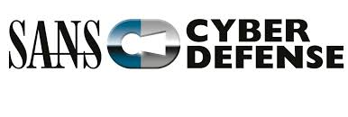

SANS SEC487 Wiki
==================

Welcome to the SANS SEC487 Wiki
----------

 
`SEC487 Portal Version: 1.0.4 - Current Course Version E01_03`

---

Contained in the wiki, you will find:

* Electronic Copies of the Lab Guides (**copy and paste, FTW!!!**)
* Tool and technique cheat sheets
* Future course content

Course/Lab/Wiki Bugs or Suggestions
----------

Please let us know if you find any bugs in the courseware/labs/wiki we need to squash. Also, reach out if you have suggestions to improve the course (e.g. content/labs/tools that should be added, removed, or updated). The easiest ways to submit these improvements is by sending an email to **<updates@sec487.info>**.

Social Media
----------

Do you have a social media account? Of COURSE you do. Feel free to use the `#SEC487` hash tag on those sites to discuss neat things you learned in class.

The course author and instructors are mostly on Twitter. Tweet to us:

* Micah Hoffman - [@WebBreacher](https://twitter.com/webbreacher) [gimmick:TwitterFollow](@webbreacher)
* David Mashburn - [@d_mashburn](https://twitter.com/d_mashburn) [gimmick:TwitterFollow](@d_mashburn)
* Mike Murr - [@mikemurr](https://twitter.com/mikemurr) [gimmick:TwitterFollow](@mikemurr)
* John TerBush - [@thegumshoo](https://twitter.com/thegumshoo) [gimmick:TwitterFollow](@thegumshoo)
* Nico Dekens - [@dutch_osintguy](https://twitter.com/dutch_osintguy) [gimmick:TwitterFollow](@dutch_osintguy)
* [@SANSDefense](https://twitter.com/sansdefense) [gimmick:TwitterFollow](@SANSDefense)
* [#SEC487](https://twitter.com/search?q=%23sec487&src=typd)

Wiki Change Log
---------------

Our course is ever-evolving due to the changes in OSINT tools, sites, and techniques. Our wiki too changes. Our change log of major changes can be found at [changelog.md](/Labs/changelog.md).
